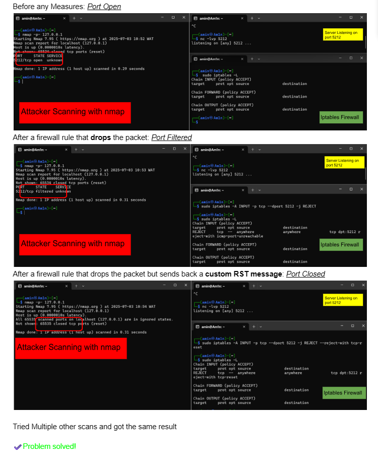

# Port Knocking: Filtered Port Misinterpretation

## Problem
After implementing **Port Knocking**, the SSH port no longer appeared **open**, but instead showed as **filtered**.  
This can still attract attackers’ attention.

### How Scanning Tools Work
Scanning tools like **nmap** determine port state by interpreting responses after sending requests to a given port:

| Port State | Response   |
|------------|------------|
| **Open**   | SYN-ACK    |
| **Closed** | RST        |
| **Filtered** | No response |

---

## Solution
Changing the response from the firewall can trick the scanning tool into thinking the port is actually **closed**, rather than **filtered**.

Instead of silently dropping packets with:
```bash
sudo iptables -A INPUT -p tcp --dport 5212 -j REJECT
```

Use this command:
```bash
sudo iptables -A INPUT -p tcp --dport 5212 -j REJECT --reject-with tcp-reset
```
This way, **nmap** interprets the response as **closed** instead of **filtered**.

---

## Comparison
Here is a detailed comparison:  


---

## Outcome
Tried multiple scans and consistently achieved the desired result.  

✔️ **Problem Solved!**
